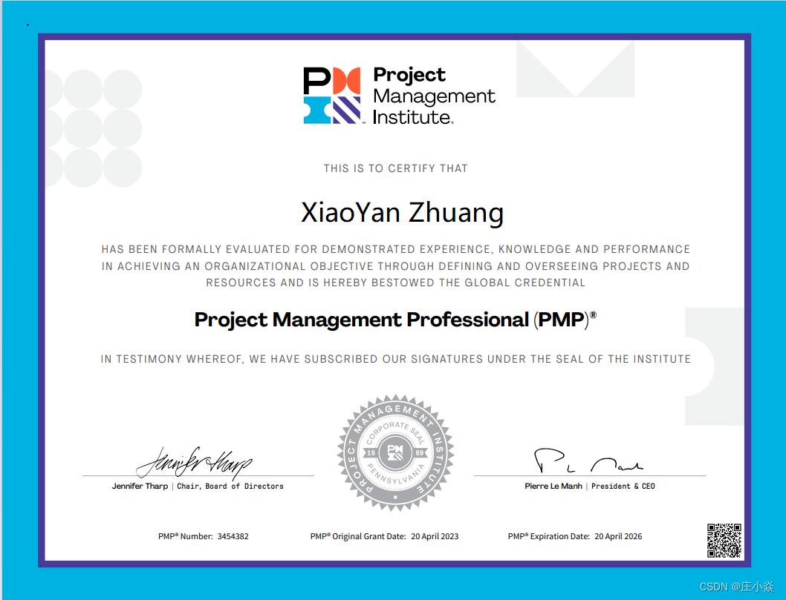

# <h1 align="center">《庄小焱——努力成长为一名优秀的架构师》</h1>

> 我是庄小焱。任职于世界100强软件研发中心，PMP项目管理专家、系统架构设计师(高级)、CSDN博文专家.
> 博主在系统架构、容器化技术、大数据、机器学习领域不断学习,同时我将在博客中持续不断分享自己的学习知识和相关技术,
> 欢迎大家和我交流学习,欢迎大家关注我的博客.

# 个人证书

# 个人社区资源

- [庄小焱网站](https://2462612540.github.io/SeniorArchitect/)
- [庄小焱github](https://github.com/2462612540)
- [庄小焱gitee](https://gitee.com/xjl2462612540)
- [庄小焱CSDN](https://blog.csdn.net/weixin_41605937?type=blog)
- [庄小焱雀语](https://www.yuque.com/dashboard/my_books)

# 联系方式

> 如果你有什么问题想与我沟通交流的话.你可以使用邮件与我联系,我的邮箱是：18279148786@163.com
> 或者你也可以直接联系加我微信,我的微信号: Mike-Scofield-Love
